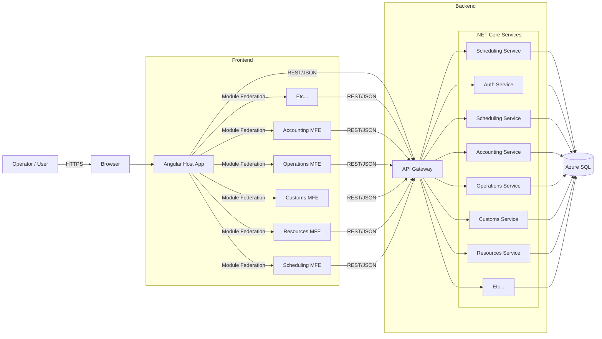

# Architecture Overview

PMIS is built as a **micro-frontend** and **microservice** architecture.

---

## Frontend Architecture

| Component      | Path                           | Port | Tech                          |
| -------------- | ------------------------------ | ---- | ----------------------------- |
| Host           | `pmis-frontend/host`           | 4200 | Angular 20, Module Federation |
| Scheduling MFE | `pmis-frontend/scheduling-mfe` | 4201 | Angular 20, Module Federation |
| Accounting MFE | `pmis-frontend/accounting-mfe` | 4202 | Angular 20, Module Federation |
| Operations MFE | `pmis-frontend/operations-mfe` | 4203 | Angular 20, Module Federation |
| Customs MFE | `pmis-frontend/customs-mfe` | 4204 | Angular 20, Module Federation |
| Resources MFE | `pmis-frontend/resources-mfe` | 4205 | Angular 20, Module Federation |
| ...            | ...                            | ...  | ...                           |

- Ports `4200` reserved for the host.

---

## Backend Architecture

| Service     | Path                       | Port | Tech                            |
| ----------- | -------------------------- | ---- | ------------------------------- |
| API Gateway | `pmis-backend/api-gateway` | 5000 | ASP.NET Core 8, YARP            |
| Auth        | `pmis-backend/auth`        | 5001 | ASP.NET Core 8, IdentityServer  |
| Scheduling  | `pmis-backend/scheduling`  | 5100 | ASP.NET Core 8, EF Core, Scalar |

- Ports `5000-5099` reserved for core and cross cutting services.
- Ports `5100-5999` reserved for services.

---

## Technology Stack

### Frontend

* **Angular 20 (Angular)** — [https://angular.dev](https://angular.dev)
  TypeScript-based web application framework maintained by Google.
* **Webpack 5 Module Federation (MF)** — [https://webpack.js.org/concepts/module-federation](https://webpack.js.org/concepts/module-federation)
  Load code from multiple builds at runtime.
* **PrimeNG** — [https://primeng.org](https://primeng.org)
  UI component library for Angular.
* **Tailwind CSS** — [https://tailwindcss.com](https://tailwindcss.com)
  Utility-first CSS framework (v4 import style).

### Backend

* **ASP.NET Core 8 (ASP.NET)** — [https://learn.microsoft.com/aspnet/core](https://learn.microsoft.com/aspnet/core)
  Cross-platform framework for web/services.
* **Entity Framework Core (EF Core)** — [https://learn.microsoft.com/ef/core](https://learn.microsoft.com/ef/core)
  ORM for .NET with LINQ and migrations.
* **FluentValidation** — [https://docs.fluentvalidation.net](https://docs.fluentvalidation.net)
  Strongly-typed validation rules.
* **Serilog** — [https://serilog.net](https://serilog.net)
  Structured logging for .NET.
* **YARP (Yet Another Reverse Proxy)** — [https://microsoft.github.io/reverse-proxy/](https://microsoft.github.io/reverse-proxy/)
  .NET reverse proxy & gateway.
* **Scalar** — [https://scalar.com](https://scalar.com)
  OpenAPI documentation and exploration.

### Monorepo & Tooling

* **Turborepo** — [https://turbo.build](https://turbo.build)
  High-performance JS/TS monorepo build system.
* **pnpm (Performant NPM)** — [https://pnpm.io](https://pnpm.io)
  Fast, disk-efficient package manager.
* **Nextra** — [https://nextra.site](https://nextra.site)
  Next.js-based documentation site framework.
* **MDX (Markdown + JSX)** — [https://mdxjs.com](https://mdxjs.com)
  Write JSX in Markdown documents.

---

## Integration

### Current State

* **API contract**
  All frontend requests go through the **API Gateway** at `/api/*`. MFEs use relative paths; the gateway routes to services.

* **Module Federation**
  Host declares stub remotes in webpack; the **only source of truth** for remote URLs is the manifest served at `/assets/mf.manifest.json`.
  Shared dependencies: Angular core/common/router and RxJS (singletons, strict version).
  `zone.js` is imported locally and not shared.

* **Development workflow**
  Host on **:4200**, remotes on **:4201+**. Only the host injects a dev-server client. Remotes run quietly (no HMR/live reload).
  Cross‑module HMR is **not implemented**; full reload is used for stability.

* **Production / Preview workflow**
  Build with `ng build -c production`. Static servers (`serve -s`) run on normalized ports (host `:5000`, remotes `:5001+`).
  CORS enabled for remote assets. SPA fallback ensures deep links (`/settings`, `/scheduling`) work.

* **Manifest handling**
  Host build includes `/assets/mf.manifest.json` in `dist`. At runtime the host loads this manifest and wires remotes dynamically.
  Developers update the manifest; webpack configs remain stable.

### Future Direction

* **Cross-module HMR**: backlog — host HMR with MF pre-init for hot updates without reload storms.
* **Shared libraries**: introduce `@pmis-frontend/ui`, `@pmis-frontend/api` as duplication emerges.
* **Auth & observability**: wire host and MFEs to Auth Service and logging/telemetry via the gateway.
* **Additional MFEs**: extend manifest and host routing for Reports, Messages, and other domains.

---

## First Integration Checklist

* [ ] Gateway running on `:5000`; host proxy `/api → :5000`.
* [ ] Manifest served at `/assets/mf.manifest.json` and loaded by host.
* [ ] Scheduling MFE loads via `/scheduling` and calls gateway APIs.
* [ ] CORS confirmed in preview/prod (host ↔ remote).
* [ ] Tailwind styles active in host and remotes (v4 `@import "tailwindcss";`).
* [ ] SPA fallback working for deep links.
* [ ] Sidebar links match implemented routes; unknown routes redirect to default.
