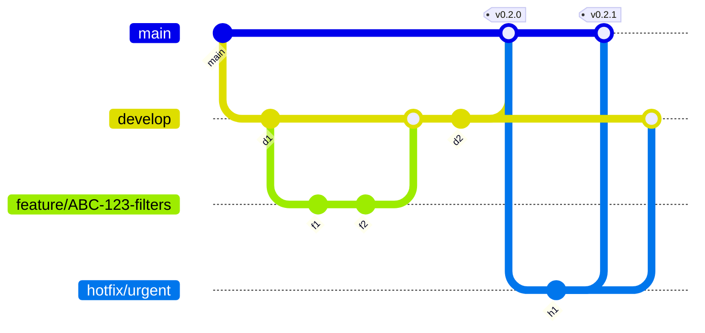

# Branching Workflow

Strategy: Gitflow-lite (`main`, `develop`, short-lived `feature/`, `fix/`, `hotfix/`).

## Workflow

- Branch from `develop` for features/fixes
- Open PR → CI (build/lint/test) must pass
- Merge to `develop`
- Release: merge `develop` → `main` + tag
- Hotfix: branch from `main`, merge back to `main` and `develop`

