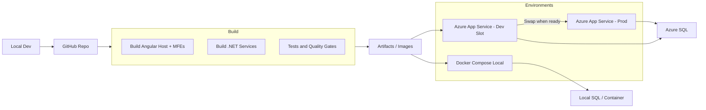

# Deployment Guide

This guide covers deployment strategies for the PMIS system.

## Production Build

<Steps>
### Build Frontend
```bash
pnpm build:prod:fe
```

### Build Backend
```bash
pnpm build:be
```
</Steps>

## Docker Deployment

Each service can be containerized:

### Frontend Services
```dockerfile
FROM node:18-alpine
WORKDIR /app
COPY package*.json ./
RUN npm install
COPY . .
RUN npm run build
EXPOSE 4200
CMD ["npm", "run", "serve:prod"]
```

### Backend Services
```dockerfile
FROM mcr.microsoft.com/dotnet/aspnet:8.0
WORKDIR /app
COPY bin/Release/net8.0/publish/ .
EXPOSE 5000
ENTRYPOINT ["dotnet", "api-gateway.dll"]
```

## Environment Configuration

Set the following environment variables:

- `ASPNETCORE_ENVIRONMENT=Production`
- `ConnectionStrings__DefaultConnection=<your-db-connection>`
- `Authentication__Authority=<your-oidc-provider>`

<Callout type="warning">
Never commit secrets. Use environment variables or secret managers.
</Callout>

## Health Checks

All services expose health endpoints:
- Gateway: `GET /health`
- Scheduling: `GET /health`

## Pipeline Overview


CI/CD is deliberately light for MVP; blue-green via slot swap comes later.