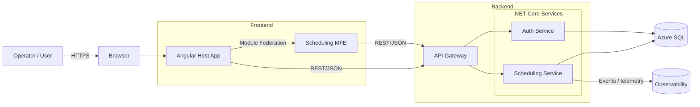

# PMIS Overview

PMIS is a **Port Management Information System** built with a **micro-frontend** Angular UI and **microservice** .NET backend, connected through an API Gateway.

---

## Quick Start

<Cards>
  <Card title="Getting Started" href="./guides/getting-started" arrow className="!bg-transparent" icon={🚀}>
    Install & run locally.
  </Card>
  <Card title="Architecture" href="./guides/architecture" arrow className="!bg-transparent" icon={🏗️}>
    System overview and tech stack.
  </Card>
  <Card title="API Reference" href="./reference/overview" arrow className="!bg-transparent" icon={📚}>
    Gateway and services.
  </Card>
</Cards>

## Services

<Cards num={2}>
  <Card title="Scheduling Service" href="./reference/scheduling" arrow className="!bg-transparent" icon={🗓️}>
    Core scheduling functions.
  </Card>
  <Card title="API Gateway" href="./reference/gateway" arrow className="!bg-transparent" icon={🛣️}>
    Single entrypoint.
  </Card>
</Cards>

## Development

<Cards>
  <Card title="Local Development" href="./guides/development" arrow className="!bg-transparent" icon={💻}>
    Dev workflow and commands.
  </Card>
  <Card title="Deployment" href="./guides/deployment" arrow className="!bg-transparent" icon={🚢}>
    Build and deploy.
  </Card>
</Cards>

---

## Local Defaults

* **Ports (all environments):**

  * Host → `:4200`
  * Scheduling MFE → `:4201`
* **API Gateway:** `/api/*` (served by backend gateway)
* **Module Federation manifest:** host serves `/assets/mf.manifest.json` as the single source of truth for remote URLs.

---

## What’s Inside

* **Frontend**: Angular 20, Module Federation, Tailwind CSS (v4)
* **Backend**: ASP.NET Core 8, EF Core, YARP gateway
* **Docs**: Nextra + MDX, with Mermaid diagrams

