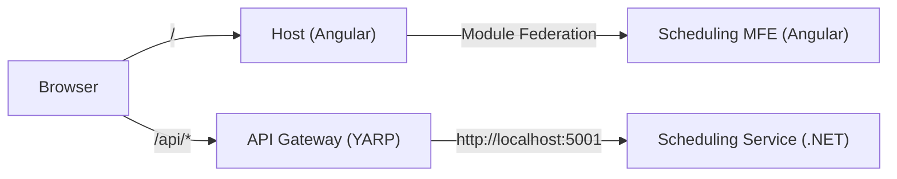

# System Overview

## Current (MVP)

- Host MFE (Angular)
- Scheduling MFE (Angular)
- API Gateway (YARP)
- Scheduling Service (.NET)
- No Auth yet (authentication planned; routes are open in dev)

## Planned

- Additional MFEs: Accounting, Operations, Customs
- Auth Service (OIDC)
- Unified contract-driven clients in `/packages/pmis-shared`
